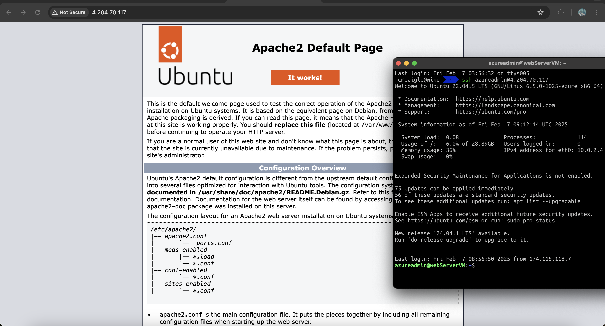

# LAB-A05 Terraform Web Server
## Student: Catherine Daigle

### Prerequisite: 
- SSH key must be located on computer ssh-keygen -t rsa
- the ssh key should be located in the ~/.ssh/id_rsa.pub.

### Screenshots:
Screenshot of apache website and ssh sign-in

