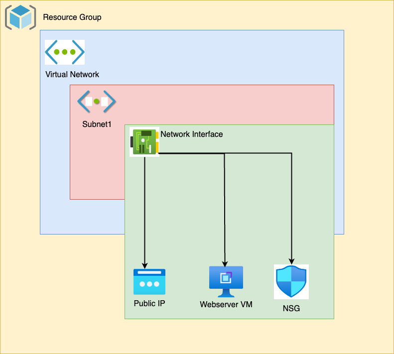

# LAB-A05 Terraform Web Server
## Student: Catherine Daigle-41175118

### Prerequisite: 
- git
- Azure CLI
- Terraform CLI
- SSH key must be located on computer ssh-keygen -t rsa
- the ssh key should be located in the ~/.ssh/id_rsa.pub.

### Errors I have encountered but solved:
- I was attempting to create an ssh key whilst the vm was being created, Instead it is solved by storing locally with above steps
- there was an error as apache was taking too long to start up externally, found out it was not installed in vm by SSH using (sudo systemctl status apache2). Solved, the VM creation profile needed to call cloudinit_config.

### Screenshots:
Screenshot of the Network Architecture Diagram:

Screenshot of apache website and ssh sign-in

